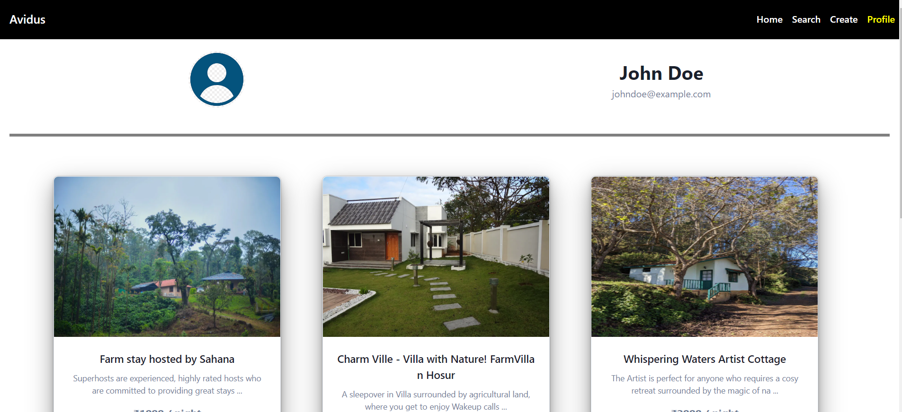

# Avidus_Interactive

<ul>
<li> The Property Booking Platform is a responsive web application built using React and Chakra UI. It allows users to browse and book properties, providing essential details such as property title, description, booking date, location, and price. Users can easily view property options, select desired dates, and receive comprehensive information to make informed booking decisions.</li>

</ul>

**To see the live site click the below link.**

https://avidus.vercel.app/

Tech Stack 
1. HTML,
2. CSS,
3. Reactjs,
4. Expressjs,
5. Nodejs,
6. MongoDB,
7. ChakraUI
8. React Router dom  
  

## Features
<ul>
  <li>Creating Properties Listing</li>
  <li>Bookings Properties</li>
   <li>filtering and sorting options for products</li>
    <li>Responsive design for optimal viewing experience across devices</li>
   <li>Login Signup</li>
</ul>

 

## Some screenshots of the project

## Signup Page

<!--  -->

## Home Page
 

## Login Page
 

## Sign up Page
 

## user Profile Page
 

## Creating Property Listing Page
 

### Thanks for reading
